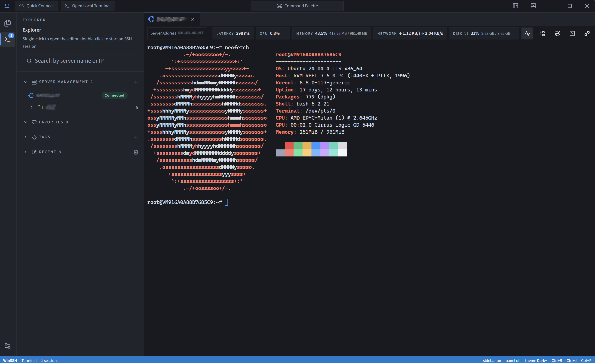

<p align="right">
  <a href="./README.md">简体中文</a> | <strong>English</strong>
</p>

<div align="center">
  
  <h1>WinSSH</h1>
  <p>🚀 <strong>A modern, powerful, and beautiful cross-platform desktop SSH / SFTP client</strong> 🚀</p>
  <p>Built with Electron 39 · React 19 · TypeScript 5 · Tailwind CSS 4</p>

  <p>
    <a href="https://github.com/lantongxue/winssh/releases">
      
    </a>
    
    
    
  </p>
</div>

---

## 📖 Introduction

**WinSSH** is a cross-platform SSH and SFTP client designed for developers and system administrators. Moving away from the cluttered and cumbersome UI of traditional terminal tools, we aim to integrate **SSH sessions, local terminals, SFTP file transfers, port forwarding, command palettes, credential vaults, away reminder**, and a **personalized theme system** all within a single window. No more frequent context-switching between tools — WinSSH delivers a fast, smooth, and immersive operations experience.

<div align="center">
  
</div>

---

## ✨ Key Features

WinSSH is more than just a terminal emulator; it is a complete, closed-loop operations workbench:

- 🏠 **Unified Workbench** — Manage SSH remote sessions and local terminals under a single tabbed interface. Utilizing a **keep-mounted strategy**, terminal instances (xterm.js) remain resident in memory when switching tabs, preventing disruption to active commands and output context.
- 📁 **Deeply Integrated SFTP** — Provides a visual remote file manager supporting **two-way drag-and-drop upload/download** with local file explorers, batch actions, and permission management. **Integrated with Monaco Editor**, double-clicking remote text files allows inline editing with instant background sync on save.
- ⚡ **Command Palette & Custom Commands** — Summon a global command palette with a keyboard shortcut. Besides tracking command history, you can save frequently-used operations commands for one-click execution to boost efficiency.
- 🔒 **Credential Vault** — Safely hosts passwords and private keys to isolate sensitive account data, with support for Jump Server (single-hop proxy) traversal.
- 📊 **Real-time Host Resource Monitoring** — Ready to use out of the box with no remote agent installation required. Displays real-time charts in the sidebar or bottom panel showing Linux server CPU, memory, network throughput, and disk I/O metrics.
- 🌐 **Flexible Port Forwarding** — Supports Local Port Forwarding and Remote Port Forwarding, with automatic rule restoration after reconnection when network fluctuations occur.
- 🎨 **VSCode-style Themes** — Built-in collection of beautiful, high-contrast themes, supporting standard VSCode JSON theme imports and automatic syncing with system Dark/Light modes.
- ☁️ **WebDAV Cloud Sync** — Back up and restore host configurations, credentials, and preferences via WebDAV. Automatically performs a hot-relaunch upon successful configuration restoration.
- ⏰ **Away Reminder** — Detects user inactivity, displaying a protective overlay and locking the terminal windows to safeguard data privacy.

---

## 🛠️ Tech Stack

WinSSH is built on top of a mature and modern frontend ecosystem for high performance:

- **Shell Environment**: Electron 39
- **Frontend Framework**: React 19 (Hooks) + TypeScript 5
- **Build System**: Vite 7 + electron-vite
- **CSS Styling**: Tailwind CSS 4
- **Core Dependencies**:
  - [xterm.js](https://github.com/xtermjs/xterm.js) - Terminal rendering engine supporting WebGL acceleration and Web fonts
  - [Monaco Editor](https://github.com/microsoft/monaco-editor) - Inline text editing for remote files
  - [ssh2](https://github.com/mscdex/ssh2) - Efficient, pure Node.js SSH2 protocol library
  - [node-pty](https://github.com/microsoft/node-pty) - Local pseudo-terminal bridge
  - [better-sqlite3](https://github.com/WiseFlatfish/better-sqlite3) - High-speed embedded SQLite driver
  - [electron-updater](https://github.com/electron-userland/electron-builder) - Auto-update check and notification module

---

## 🚀 Installation & Local Development

### Prerequisites

- **Node.js**: `22.x` or higher
- **npm**: `10.x` or higher

### Development Steps

1. **Clone the repository**:

   ```bash
   git clone https://github.com/lantongxue/winssh.git
   cd winssh
   ```

2. **Install dependencies** (this automatically triggers compilation of C++ native modules):

   ```bash
   npm install
   ```

3. **Start Electron in development mode** (supports hot-reloading for both main and renderer processes):
   ```bash
   npm run dev
   ```

### Packaging & Distribution

This project uses `electron-builder` to package applications for various platforms:

```bash
# Build Windows installers (NSIS installer & portable ZIP)
npm run dist:win

# Build macOS installers (DMG image & ZIP)
npm run dist:mac

# Build Linux installers (AppImage & DEB package)
npm run dist:linux
```

---

## 📂 Project Directory Structure

```text
winssh/
├── src/
│   ├── main/              # Electron main process (Node.js) - handles DB operations, SSH/SFTP connections, away activity, and auto-updates
│   ├── preload/           # contextBridge secure IPC channel definitions (only index.ts and index.d.ts)
│   ├── renderer/          # React renderer process - workbench interaction layer, state management, and feature API clients
│   └── shared/            # Shared codebase - validation schemas (Zod), global types, constants, and IPC channel definitions
├── themes/                # Built-in VSCode-style JSON themes
├── official-website/      # Brand official website & online documentation (Vite + React)
├── docs/                  # Supplementary design and theme development guidelines
├── scripts/               # Scripts for builds, package patches, mock update server, etc.
└── build/                 # App icons and custom NSIS installer configurations (.nsh)
```

---

## 💻 Script Reference

| Command              | Description                                                                         |
| :------------------- | :---------------------------------------------------------------------------------- |
| `npm run dev`        | Starts the client local development server (with Hot Module Replacement)            |
| `npm run build`      | Runs TypeScript type checking and builds the production Electron application        |
| `npm run test`       | Runs all Vitest unit and integration tests                                          |
| `npm run typecheck`  | Separately performs TS type checks on both main (Node) and renderer (Web) processes |
| `npm run format`     | Formats all code with Prettier to maintain a consistent style                       |
| `npm run lint`       | Runs ESLint to check for code style issues and rules violation                      |
| `npm run site:dev`   | Starts the local dev server for the brand website in `official-website/`            |
| `npm run site:build` | Builds the static production assets for the brand website                           |

---

## 💡 Environment Variables

WinSSH supports configuring specific runtime behaviors via environment variables:

| Environment Variable           | Default | Description                                                                                                    |
| :----------------------------- | :------ | :------------------------------------------------------------------------------------------------------------- |
| `WINSSH_HARDWARE_ACCELERATION` | -       | Set to `false` to disable hardware acceleration on Windows (useful for solving rendering lag on some hardware) |

---


## 🤝 Contributing

If you encounter any bugs or have ideas for improvements, feel free to open an issue or submit a pull request!

Before submitting a PR, please make sure all local checks pass successfully:

```bash
# Run type checks and all unit/integration tests
npm run typecheck && npm run test
```

- **Commit Message Guidelines**: Please follow the [Conventional Commits](https://www.conventionalcommits.org/) specification (e.g., `feat: add xterm font size configuration`).
- **Code Formatting**: Run `npm run format` to format your code before committing.

---


<div align="center">
  <p>Made with ❤️ by the WinSSH Team.</p>
  <p>Released under the <a href="LICENSE.en">License</a>.</p>
</div>
