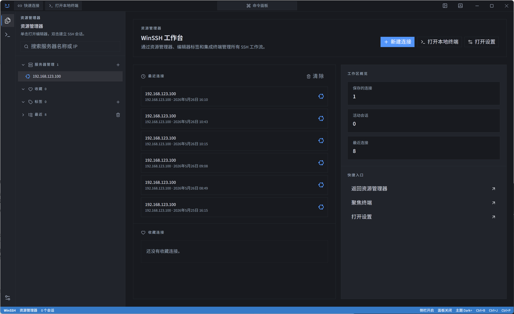
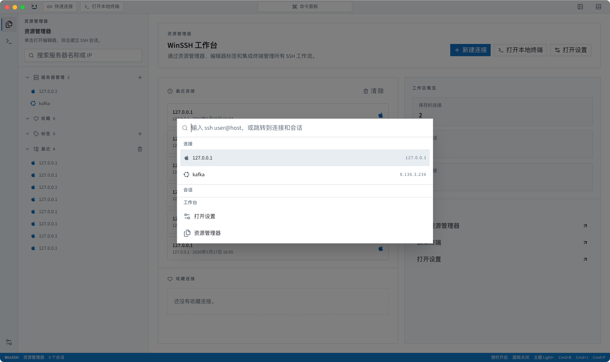
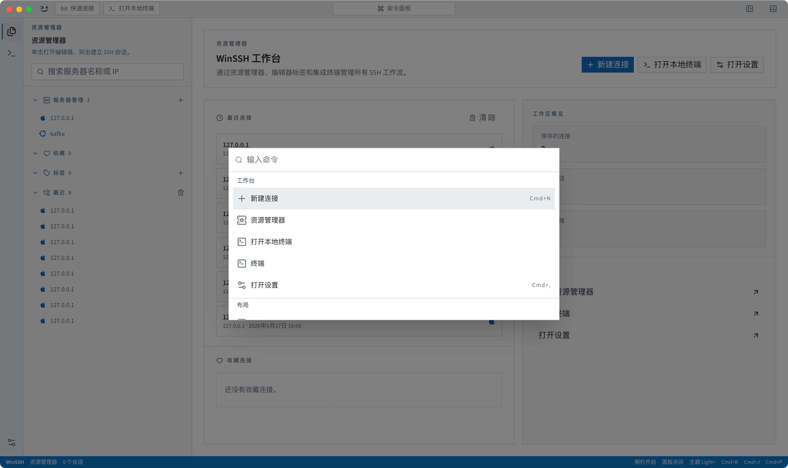
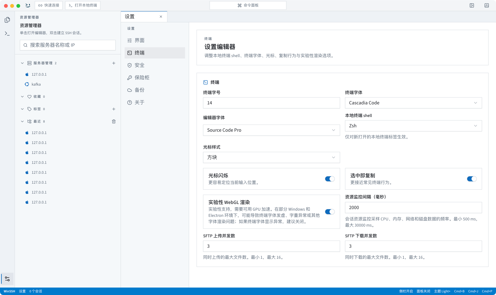
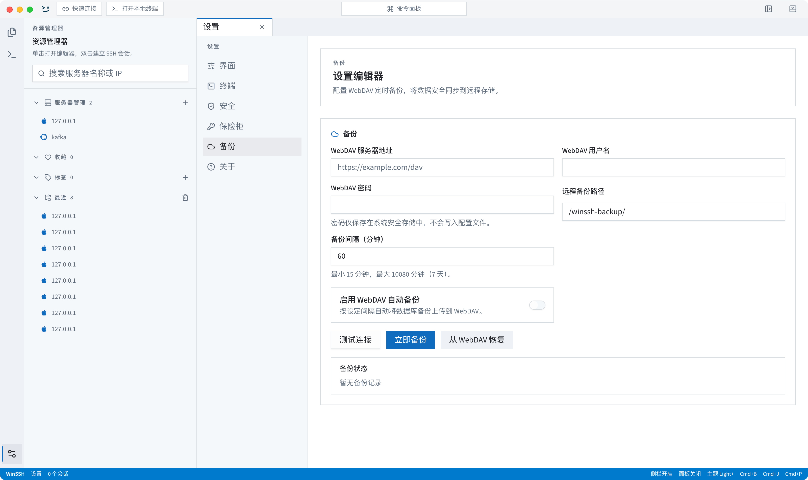
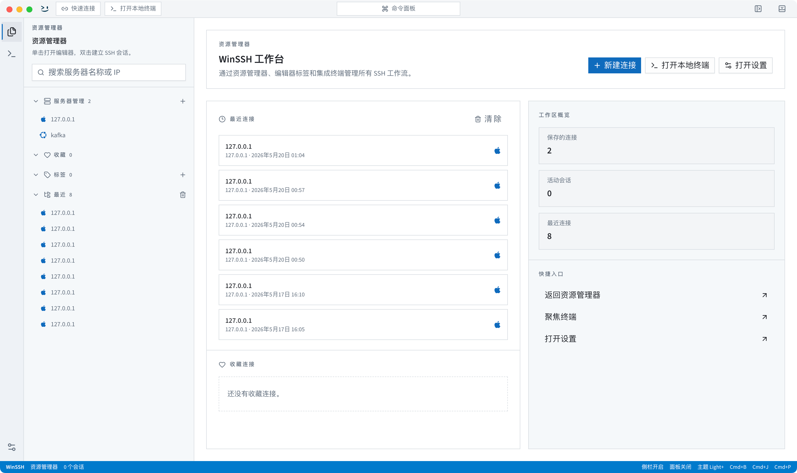

<p align="right">
  <strong>简体中文</strong> | <a href="./README.en.md">English</a>
</p>

<div align="center">
  
  <h1>WinSSH</h1>
  <p>🚀 <strong>现代、强大、高颜值的跨平台桌面 SSH / SFTP 客户端</strong> 🚀</p>
  <p>基于 Electron 39 · React 19 · TypeScript 5 · Tailwind CSS 4 构建</p>

  <p>
    <a href="https://github.com/lantongxue/winssh/releases">
      
    </a>
    
    
    
  </p>
</div>

---

## 📖 简介

**WinSSH** 是一款专为开发者与系统管理员打造的跨平台 SSH 和 SFTP 客户端。我们摒弃了传统终端工具杂乱繁琐的界面设计，致力于在单个窗口内将 **SSH 会话、本地终端、SFTP 文件传输、端口转发、命令面板、凭据保险箱、暂离保护** 和 **个性化主题系统** 深度融合。免去频繁切换工具的烦恼，为您提供极速、流畅的沉浸式运维体验。

<div align="center">
  
</div>

---

## ✨ 特性亮点

WinSSH 不仅仅是一个终端渲染器，它是一个完整、闭环的运维工作台：

- 🏠 **统一 Workbench** — 将 SSH 远端会话与本地终端以 Tab 标签页形式统一管理。支持 **keep-mounted 策略**，切换标签时终端实例（xterm.js）常驻内存不销毁，保证操作状态与输出上下文不中断。
- 📁 **深度整合的 SFTP 模块** — 提供可视化的远端文件管理器，支持与本地资源管理器**双向拖拽上传/下载**、批量操作及权限管理。**集成 Monaco Editor**，双击远端文本文件即可内联编辑，保存即刻后台同步。
- ⚡ **命令面板与自定义命令** — 支持快捷呼出全局命令面板。除了记录历史执行命令外，还可以添加常用运维命令，一键快速执行，极大提升运维效率。
- 🔒 **凭据保险箱 (Credential Vault)** — 采用系统级安全凭据通道（keytar）进行敏感账户信息隔离，支持密码、私钥统一安全托管，并支持 Jump Server（单跳代理）穿透。
- 📊 **实时主机资源监控** — 无需远端安装任何代理程序，即开即用。在侧边或底部面板以图表形式实时采样 Linux 服务器的 CPU 占比、内存占用、网速吞吐及磁盘 IO。
- 🌐 **灵活的端口转发** — 支持本地端口转发 (Local Port Forwarding) 与远程端口转发 (Remote Port Forwarding)，网络出现波动断连重连后，转发规则支持自动恢复。
- 🎨 **VSCode 风格主题包** — 内置多款精美的高对比度主题，支持 VSCode 风格的标准 JSON 主题包导入，配合系统暗黑/明亮模式自动切换。
- ☁️ **WebDAV 云端同步** — 支持基于 WebDAV 协议对本地所有主机配置、凭据和偏好设置进行一键备份与云端恢复，恢复后自动热重启。
- ⏰ **暂离保护 (Away Reminder)** — 自动检测用户无操作暂离状态，展示保护性提示遮罩并锁定终端视窗，妥善保护数据隐私安全。

---

## 📸 功能截图展示

<details>
  <summary>🔍 点击展开查看更多功能截图</summary>
  <br />

  <table width="100%">
    <tr>
      <td width="50%">
        <p align="center"><strong>🏠 主页与服务器列表</strong></p>
        
      </td>
      <td width="50%">
        <p align="center"><strong>⚡ 快捷连接面板</strong></p>
        
      </td>
    </tr>
    <tr>
      <td width="50%">
        <p align="center"><strong>💻 全局命令面板</strong></p>
        
      </td>
      <td width="50%">
        <p align="center"><strong>⚙️ XTerm 终端高级设置</strong></p>
        
      </td>
    </tr>
    <tr>
      <td width="50%">
        <p align="center"><strong>☁️ WebDAV 备份管理</strong></p>
        
      </td>
      <td width="50%">
        <p align="center"><strong>🎨 护眼明亮模式 (Light Mode)</strong></p>
        
      </td>
    </tr>
  </table>
</details>

---

## 🛠️ 技术选型

WinSSH 基于成熟的前沿前端生态构建，性能卓越：

- **壳体环境**: Electron 39
- **前端框架**: React 19 (Hooks) + TypeScript 5
- **构建链**: Vite 7 + electron-vite
- **CSS 样式**: Tailwind CSS 4
- **核心包依赖**:
  - [xterm.js](https://github.com/xtermjs/xterm.js) - 终端渲染引擎，支持 WebGL 加速与 Web 字体
  - [Monaco Editor](https://github.com/microsoft/monaco-editor) - 远端文本内联编辑利器
  - [ssh2](https://github.com/mscdex/ssh2) - 纯 Node.js 实现的高效 SSH2 协议库
  - [node-pty](https://github.com/microsoft/node-pty) - 本地伪终端桥接接口
  - [better-sqlite3](https://github.com/WiseFlatfish/better-sqlite3) - 极速本地嵌入式 SQLite 驱动
  - [keytar](https://github.com/atom/keytar) - 跨平台系统安全钥匙串通道
  - [electron-updater](https://github.com/electron-userland/electron-builder) - 自动更新检测更新模块

---

## 🚀 安装与本地开发

### 环境要求

- **Node.js**: `22.x` 或更高版本
- **npm**: `10.x` 或更高版本

### 开发步骤

1. **克隆仓库**：

   ```bash
   git clone https://github.com/lantongxue/winssh.git
   cd winssh
   ```

2. **安装依赖** (自动包含 C++ 原生模块的重构编译)：

   ```bash
   npm install
   ```

3. **启动 Electron 开发模式** (支持主进程与渲染进程热重载)：
   ```bash
   npm run dev
   ```

### 打包发布

项目使用 `electron-builder` 进行各平台分发打包：

```bash
# 构建 Windows 安装包 (NSIS 安装包与便携 ZIP)
npm run dist:win

# 构建 macOS 安装包 (DMG 映像与 ZIP)
npm run dist:mac

# 构建 Linux 安装包 (AppImage 与 DEB 安装包)
npm run dist:linux
```

---

## 📂 项目目录结构

```text
winssh/
├── src/
│   ├── main/              # Electron 主进程 (Node.js) — 处理底层数据库、SSH/SFTP连接、暂离活动、自动更新
│   ├── preload/           # contextBridge 双向安全 IPC 通道定义 (仅包含 index.ts 与 index.d.ts)
│   ├── renderer/          # React 渲染进程 — Workbench 交互层、状态管理、模块 API 代理
│   └── shared/            # 共享资源层 — 数据校验 Schema (Zod)、全局类型、常量、IPC 通道定义
├── themes/                # 内置 VSCode 风格 JSON 主题包
├── official-website/      # 品牌官方网站与在线文档工程 (Vite + React)
├── docs/                  # 辅助设计与主题包开发指南文档
├── scripts/               # 构建、打包补丁、Mock 更新静态服务器等脚本
└── build/                 # 打包图标以及平台安装器定制配置 (.nsh)
```

---

## 💻 常用脚本指令

| 脚本命令             | 描述                                              |
| :------------------- | :------------------------------------------------ |
| `npm run dev`        | 启动客户端本地开发服务器 (支持模块热替换)         |
| `npm run build`      | 对全量 TS 代码进行类型检查并构建 Electron 产物    |
| `npm run test`       | 运行项目下全量 Vitest 单元与集成测试              |
| `npm run typecheck`  | 独立对 Node 进程与 Web 渲染进程运行 TS 类型检查   |
| `npm run format`     | 执行 Prettier 格式化，规范全局代码风格            |
| `npm run lint`       | 运行 ESLint 代码规范扫描与约束排查                |
| `npm run site:dev`   | 启动 `official-website/` 品牌官网的本地开发服务器 |
| `npm run site:build` | 打包构建品牌官网静态部署产物                      |

---

## 💡 环境变量参考

WinSSH 支持通过环境变量修改特定运行时行为：

| 环境变量                       | 默认值 | 说明                                                                  |
| :----------------------------- | :----- | :-------------------------------------------------------------------- |
| `WINSSH_HARDWARE_ACCELERATION` | -      | 设为 `false` 可在 Windows 平台强制关闭硬件加速 (解决部分设备渲染卡顿) |

---


## 🤝 参与贡献

如果您在使用过程中发现了 bug 或者有好的想法，欢迎提交 Issue 或 Pull Request！

在提交 PR 之前，请务必保证本地验证能够全量通过：

```bash
# 验证代码类型与单元测试
npm run typecheck && npm run test
```

- **提交规范**：请遵循 Conventional Commits 提交规范（例如 `feat: add xterm font size configuration`）。
- **格式要求**：提交前请使用 `npm run format` 美化代码格式。

---


<div align="center">
  <p>Made with ❤️ by the WinSSH Team.</p>
  <p>Released under the <a href="LICENSE">MIT License</a>.</p>
</div>
